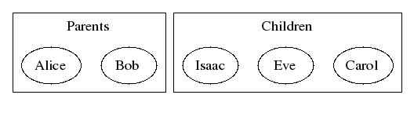
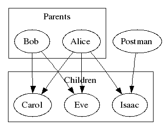
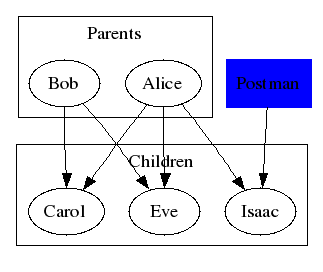
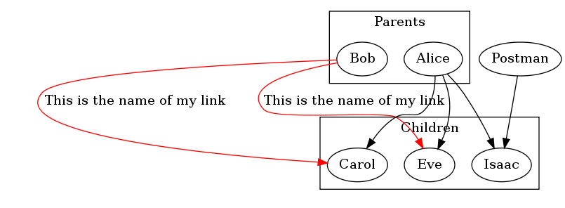
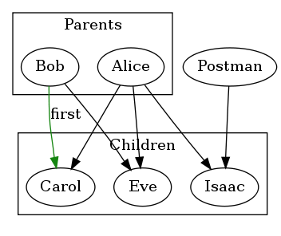
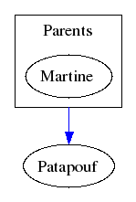
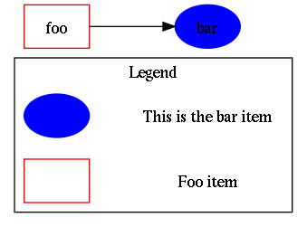
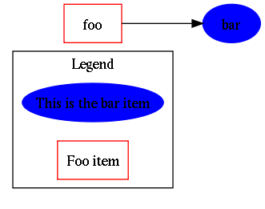
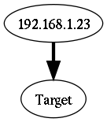
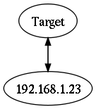

# GvGen

GvGen is a python class to generate dot files that you can use with [Graphviz][graphviz].

## Features

* Node creation, naming and connection
* Apply any graphviz property on the fly
* Apply graphviz properties to a style
* Add a legend to your graph easily 
* Python 2/3 compatible

### Examples

#### Simple

Use the class:

```python
% python
Python 2.4.4 (#2, Aug 16 2007, 00:34:54) 
[GCC 4.1.3 20070812 (prerelease) (Debian 4.1.2-15)] on linux2
Type "help", "copyright", "credits" or "license" for more information.
>>> from gvgen import *
>>> graph = GvGen()
>>> parents = graph.newItem("Parents")
>>> father = graph.newItem("Bob", parents)
>>> mother = graph.newItem("Alice", parents)
>>> children = graph.newItem("Children")
>>> child1 = graph.newItem("Carol", children)
>>> child2 = graph.newItem("Eve", children)
>>> child3 = graph.newItem("Isaac", children)
>>> 
>>> graph.dot()
```

See the dot file generated: 

```
digraph G {
   subgraph cluster1 {
   label="Parents";
      edge2 [label="Bob"];
      edge3 [label="Alice"];
   }
   subgraph cluster4 {
   label="Children";
      edge5 [label="Carol"];
      edge6 [label="Eve"];
      edge7 [label="Isaac"];
   }
}
```

Save it under the name "crypto-folks.dot" 

Use graphviz to get the picture: 
```
% dot -Tpng crypto-folks.dot > crypto-folks.png
```

See the result:


#### Edge Linking

The following code:
```python
    graph = GvGen()
    parents = graph.newItem("Parents")
    father = graph.newItem("Bob", parents)
    mother = graph.newItem("Alice", parents)
    children = graph.newItem("Children")
    child1 = graph.newItem("Carol", children)
    child2 = graph.newItem("Eve", children)
    child3 = graph.newItem("Isaac", children)
    postman = graph.newItem("Postman")
    graph.newLink(father,child1)
    graph.newLink(father,child2)
    graph.newLink(mother,child2)
    graph.newLink(mother,child1)
    graph.newLink(mother,child3)
    graph.newLink(postman,child3)

    graph.dot()
```

Will produce:


#### Styles

You can define any styles you want using [graphviz attributes][graphvizattr].

In our example, we simple add the following just before graph.dot(): 

```python
    graph.styleAppend("Post", "color", "blue")
    graph.styleAppend("Post", "style", "filled")
    graph.styleAppend("Post", "shape", "rectangle")
    graph.styleApply("Post", postman)
```

Which produces:


#### Properties

 You can add properties without any styles to any edge using propertyAppend:

```python
    graph.propertyAppend(postman, "color", "red")
    graph.propertyAppend(postman, "fontcolor", "white")
```

IMPORTANT: That will override styles. Any previous or next styles defined to the edge will be removed when attribute matching.
Default Styles

To avoid applying each property per node, you can define default styles using styleDefaultAppend:

```python
    graph.styleDefaultAppend("color","Green")
    graph.styleDefaultAppend("shape","octagon")
```


#### Links properties: for each node link

 GvGen allows you to specify what node links properties should have.

```python
    graph.propertyForeachLinksAppend(father, "label", "This is the name of my link")
    graph.propertyForeachLinksAppend(father, "color", "red")
```



#### Links properties: only one link

GvGen does not make you deal with the complexity of how different a link and an edge can be, you simply use the same functions.

```python
    mylink = graph.newLink(foo,bar)
    graph.propertyAppend(mylink, "color", "#158510")
    graph.propertyAppend(mylink, "label", "first")
```



#### Link from a cluster to a node

```python
>>> import gvgen
>>> g = gvgen.GvGen()
>>> pdm = g.newItem("Parents")
>>> martine = g.newItem("Martine", pdm)
>>> chien = g.newItem("Patapouf")
>>> l = g.newLink(pdm, chien)
>>> g.propertyAppend(l,"color","blue")
>>> g.dot()
digraph G {
compound=true
   subgraph cluster1 {
   label="Parents";
      edge2 [label="Martine"];
   }
   edge3 [label="Patapouf"];
edge2->edge3 [color="blue",ltail=cluster1];
}
>>> 
```




#### Adding a legend to your graph

 One feature Graphviz does not provide is the possibility to add a legend for you graph. However GvGen folks understand this is a must-have feature. First of all, you must create a special graph that is with a legend:

```python
>>> graph = gvgen.GvGen("Legend")
```

The name "Legend" can of course be modified into your native language.

Then, legend works with styles applied to a description. so you must define your styles:

```python
>>> graph.styleAppend("foostyle","color","red")
>>> graph.styleAppend("foostyle","shape","rectangle")
>>> graph.styleApply("foostyle", foo)
>>>
>>> graph.styleAppend("barstyle","color","blue")
>>> graph.styleAppend("barstyle","style","filled")
>>> graph.styleApply("barstyle", bar)
```

Finally, you must describe the styles with the legendApply() function:

```python
>>> graph.legendAppend("foostyle", "Foo item")
>>> graph.legendAppend("barstyle", "This is the bar item")
```



Or, if you prefer to have the text inside your item:

```python
>>> graph = gvgen.GvGen("Legend")
...
>>> graph.legendAppend("foostyle", "Foo item",1)
>>> graph.legendAppend("barstyle", "This is the bar item",1)
```



#### Activate smart mode

Unlike any other GvGen capabilities, the smart mode override things graphviz do. You can activate it by setting its variable to 1:

```python
>>> graph = gvgen.GvGen()
>>> graph.smart_mode = 1
```

Then, when you want to add several links, you will not see each link: each link added will increase the link line and arrow. The more links you add, the bigger they are: 



Or, if you do links in both directions:

```python
>>> graph.newLink(ip1, target)
>>> graph.newLink(target, ip1)
```

You will not get one link per direction but a both directed link instead:



Of course you can change value for link line and arrow increase. Defaults value are:

```
graph.max_line_width = 10
graph.max_arrow_width = 2
graph.line_factor = 1
graph.arrow_factor = 0.5
graph.initial_line_width = 1.2
graph.initial_arrow_width = 0.8
```


[graphviz]: http://www.graphviz.org
[graphvizattr]: http://www.graphviz.org/doc/info/attrs.html

